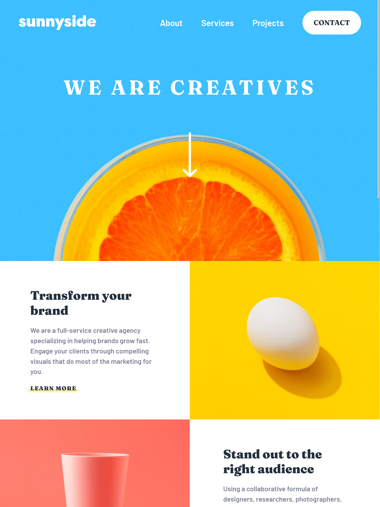

# Frontend Mentor - Sunnyside agency landing page solution

This is a solution to the [Sunnyside agency landing page challenge on Frontend Mentor](https://www.frontendmentor.io/challenges/sunnyside-agency-landing-page-7yVs3B6ef). Frontend Mentor challenges help you improve your coding skills by building realistic projects.

## Table of contents

-  [Overview](#overview)
   -  [The challenge](#the-challenge)
   -  [Screenshot](#screenshot)
   -  [Links](#links)
-  [My process](#my-process)
   -  [Built with](#built-with)
   -  [What I learned](#what-i-learned)
   -  [Useful resources](#useful-resources)
-  [Author](#author)

## Overview

### The challenge

Users should be able to:

-  View the optimal layout for the site depending on their device's screen size
-  See hover states for all interactive elements on the page

### Screenshot



### Links

-  Solution URL: [Frontendmentor Solution](https://www.frontendmentor.io/solutions/responsive-landing-page-using-css-grid-R3DFJZStAe)
-  Live Site URL: [Github Pages](https://fachi-r.github.io/sunny-side-agency-landing-page/)

## My process

1. Initialized project as a public repository on [GitHub](https://github.com/).
2. Configured repository to publish code to a web address using [GitHub Pages](https://pages.github.com/)
3. Looked through the designs to start planning out how to tackle the project. This was done ahead of time to add CSS classes for reusable styles.
4. Structured content with HTML to help focus attention on creating well-structured content.
5. Wrote out base styles for the project, including general content styles, such as `font-family`, `font-size`, and `margin` and `padding` resets.
6. Started adding styles to the top of the page and worked down.
7. Added Javascript for funcitonality.
8. Added final styles and animation at the end of the project.

### Built with

-  Semantic HTML5 markup
-  CSS custom properties
-  CSS Grid
-  Flexbox
-  Mobile-first workflow

### What I learned

The biggest takeaway from this challenge was from image optimisation so to say, as the biggest challenge was figuring out how to set the source of the image dynamically based on the screen size. This is easier in frameworks like React, but doing it in vanilla JavaScript was new to me.

Because of this I learnt how to use media queries in JavaScript using the `window.matchMedia()` function - something I intend to use in future projects to come.

```js
// Setting mobile || desktop images based on screen size
let images = document.querySelectorAll("img");
let media = window.matchMedia("(min-width: 376px)");

function setImgSrc(_media) {
   if (_media.matches) {
      images.forEach((image) => {
         const newImageSrc = image.src.replace("mobile", "desktop");
         image.src = newImageSrc;
      });
   } else {
      images.forEach((image) => {
         const newImageSrc = image.src.replace("desktop", "mobile");
         image.src = newImageSrc;
      });
   }
}

// Call the func on first load and whenever screen size changes
setImgSrc(media);
media.addListener(setImgSrc);
```

Another interesting thing I learnt was how to use CSS Grid layout. One property in particular: `grid-auto-flow: dense;`.
This property makes it possible to set positions of grid elements despite the order they appear in the HTML. So on the first row after the banner, where the image appears after the text, I had to reverse the direction of the grid, which doesn't work without this property😅.

```css
.two-column-grid {
   display: grid;
   grid-auto-flow: dense;
   /* 'dense' makes it possible to swap column positions*/
   padding: 0;
}
.grid-reverse :first-child {
   grid-column: 2;
}
```

I learnt about CSS shapes to create an arrow /(triangle) at the top-left corner of the mobile dropdown menu.

```css
/* Top Right nav triangle */
.top-nav ul::before {
   content: "";
   position: absolute;
   right: 0;
   top: calc(0rem - var(--height));
   border-bottom: var(--height) solid var(--white);
   border-left: var(--height) solid transparent;
}
```

### Useful resources

-  [Utopia](https://utopia.fyi) - A site that helps with fluid typography and design, with its fluid typogrphy and scale calculator. This helped me to come up with fluid font and spacing using CSS Clamp. I really liked this pattern and will use it going forward.
-  [MDN Web Docs](https://developer.mozilla.org/en) - This is an amazing article which helped me finally CSS grid and `grid-auto-flow: dense;`. I'd recommend it to anyone still learning this concept.
-  [CSS Tricks](https://css-tricks.com) - This is the site where i got the idea for the arrow on the corner of the mobile dropdown menu. Very helpful site with lots of css tricks to learn about.

## Author

-  GitHub - [Fachi](https://github.com/Fachi-r/)
-  Frontend Mentor - [@Fachi-r](https://www.frontendmentor.io/profile/Fachi-r)
-  Twitter - [@\_fachi_0](https://twitter.com/_fachi_0)
